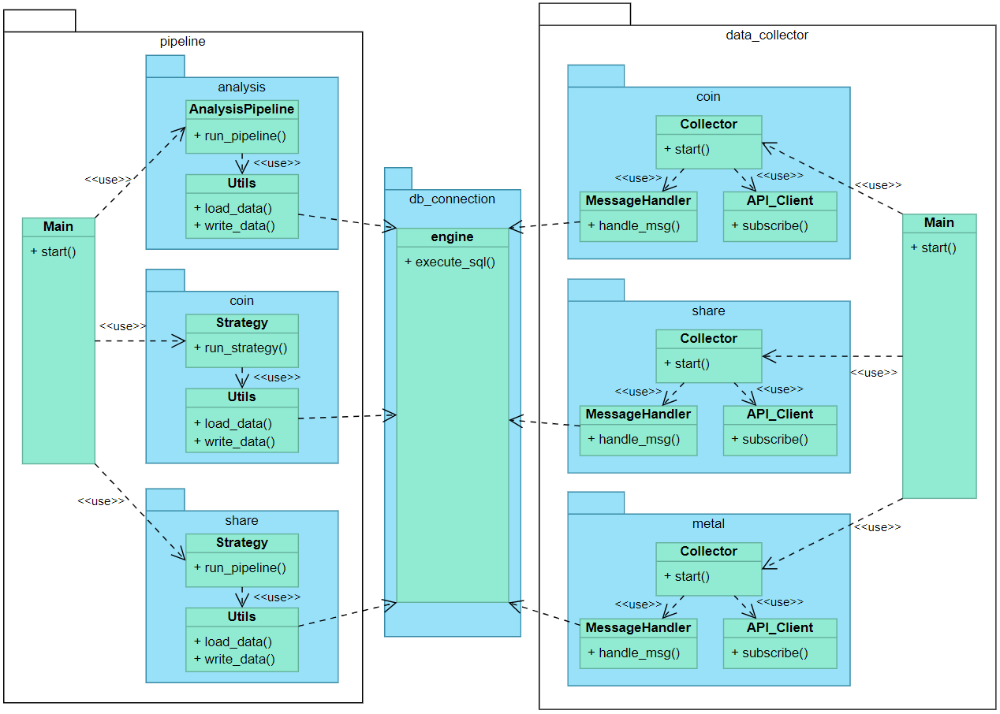

# market data analytics
Code to pull and analyze data for several markets.

The code contains 2 main parts: data collection and data analysis

For data collection several APIs are used to pull stock market,
metal market and crypto market data in real time. The pulled data
is stored in a postgres database which servers as staging are of a data warehouse.

For data analysis the stored data is pulled out of the staging are and processed
to be put into a visualization tool like tableau to build analysis dashboards.

A raw overview of the software architecture in this repo:

In order to run the project you will need to add your API Keys and database credentials
to creds.py.
